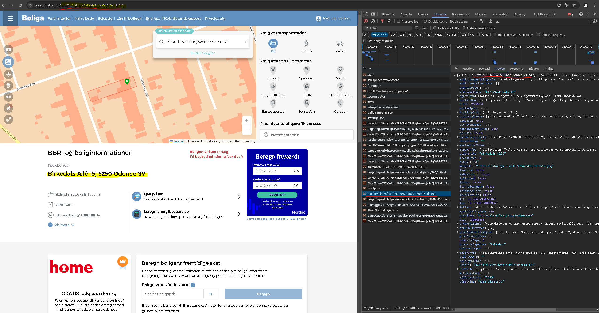

# Project_webscrape_DK_properties_Boliga
> [!NOTE]
> This project is part of the project "Empirical_Project-are_home_buyers_inattentive_towards_energy_efficiency"
>
> I Used this code to gather the property data (Sales and property characteristics) and constructed ID codes to utilize in order to gather EPC (Energy performance certificate) reports of corresponding properties

## Description : 
In this project, I developed a web scraping bot that systematically scans the entire [www.boliga.dk](https://www.boliga.dk/), gathering detailed data on property characteristics and historic transaction prices for the Danish housing market. 

Unlike the other web scraping project where I web scrape the website www.boligasiden.dk - here I am able to get both transaction price and listing price. In addition, boliga.dk provides data on the sales duration of properties and more details on the property characteristics. 

In addition, the objective here is only to gather residential properties during the period 2012 to 2023. The reason for this is due to the project "Empirical_Project-are_home_buyers_inattentive_towards_energy_efficiency". In short, the Danish authorities implemented a policy in 2012 that made it mandatory to display EPC labels (Energy efficiency of properties) in advertisements. The effect of this policy has already been investigated. Therefore, we exclude sales before 2012 as the objective of the empirical project is to investigate other matters. 

## The bot : 

## Result : 
With this script I was able to gather :
* 2.295.344 million property tranactions (sale prices)
* Property characteristics of 981.469 unique properties

### Example Data

You can view the example of the tabular data from the final result in the CSV file located in the example_data folder.
