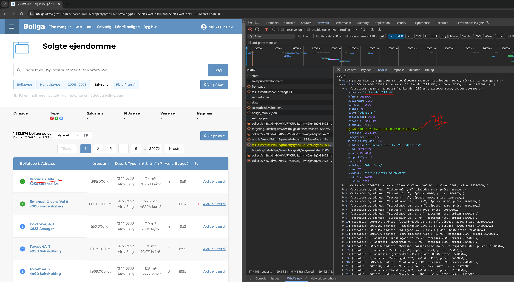

# Project_webscrape_DK_properties_Boliga
> [!NOTE]
> This project is part of the project "Empirical_Project-are_home_buyers_inattentive_towards_energy_efficiency"
>
> I Used this code to gather the property data (Sales and property characteristics) and constructed ID codes to utilize in order to gather EPC (Energy performance certificate) reports of corresponding properties

## Description : 
In this project, I web scrape the website [www.boliga.dk](https://www.boliga.dk/), gathering detailed data on property characteristics and historic transaction prices for the Danish housing market. 

Unlike the other web scraping project where I web scrape the website www.boligasiden.dk - here I am able to get both transaction price and listing price. In addition, boliga.dk provides data on the sales duration of properties and more details on the property characteristics. 

Furthermore, the objective here is only to gather residential properties, properties sold between 2006 to 2023 and properties sold under a "normal" transaction condition. The reason for this is due to the project "Empirical_Project-are_home_buyers_inattentive_towards_energy_efficiency", were I investigate how much consumers are willing to pay for energy efficient components of properties. 

## Overview of the script : 
Unlike the website boligsiden.dk - here the API doesnt seem to have any limitations. 

The webscraping process is split into two steps, first gather property ID's then extract property information then we run another script where we loop over each ID and extract the information of the property.

The first step is to go over each page and gather their property ID numbers- in this case the unique ID is given under the JSON key "UID". With this ID I am able to access the JSON file containing the property characteristics and their transaction prices of each property in the next step. Thankfully, we can access the IDs through a "hidden" API under https://api.boliga.dk/. The image below shows how to find the API. Particularily, how to access the API endpoint with the property IDs (which in my case is : https://api.boliga.dk/api/v2/sold/search/results?searchTab=1&propertyType=1,2,3&saleType=1&salesDateMin=2006&salesDateMax=2023&sort=date-d) 

Before I run the script I initiallize certain parameters, as mentioned in the "description" chapter above. Based on these parameters, the boliga.dk website has in store 1.513.574 properties. Each page displayes 50 properties which means that there should be in total 30.272 pages. 

Once I have gone over each page and gathered all possible UID codes I move on to the next step where I run another script which makes another GET request to the same API but from another endpoint to fetch the JSON file of each property containing their characteristics and transaction prices.   

I run another script which collects all property info. In order to get property information I make a GET request to the same API but with a different endpoint. In this case the endpoint is : 
"https://api.boliga.dk/api/v2/bbrinfo/bbr?id=". I loop over each UID codes collected and enter them into this string at the end e.g. https://api.boliga.dk/api/v2/bbrinfo/bbr?id=1b975f2d-b7cf-4e8e-b009-b604c6ed1192. This example is from the property "Birkedals Allé 15, 5250 Odense SV"

To find this API endpoint I recommend navigating to the property info page with the "inspect" open. As an example, lets say I click on the property "Birkedals Allé 15, 5250 Odense SV" as shown in the image above (the first property). This takes me to what i will call "Overview" page, but inorder to get the honey that we want you must click on the "se alle BBR-informationer on adressen". Once you do that the API endpoint that we want appears. 

## Result : 
With this script I was able to gather :
* 2.623.340 property transactions (real prices)
* Property characteristics of 1.031.595 unique properties
    
However, after analysing the data and cleaning it from potential data errors and duplicated properties I end up with a clean dataset of:
* 2.295.344 million property tranactions (sale prices)
* Property characteristics of 981.469 unique properties
* This version was utilized in the empirical project

### Example Data

You can view the example of the tabular data from the final result in the CSV file located in the example_data folder.
